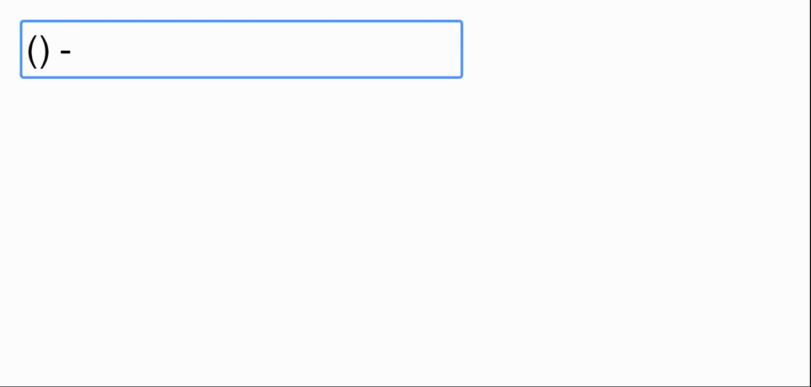

# Phone Input Template

This javascript file creates a phone number template for an input box of your choice.  
Users just type their number and it will auto format.



# Setting up

1. Create and navigate to the /js folder in the root of your project  
2. Clone the repo  
`git clone https://github.com/sottom/phoneInputTemplate.git`
3. Add a script tag with the path to the phoneInputTemplate.js file at the top of your html file  
`<script src="/js/phoneInputTemplate/phoneInputTemplate.js"></script>`
4. Create an input tag with an id (any name you want)  
`<input type="text" id="myInput">`
5. Add script tag before the ending body tag and pass the input's id into the phoneTemplate() function
```
  <script>
    phoneTemplate("myInput");
  </script>
  ```
6. Run your project  

# Example

```
<html>
<head>

  <!-- path to phoneInputTemplate.js -->
  <script src="/js/phoneInputTemplate/phoneInputTemplate.js"></script>

</head>
<body>

  <!-- input box must have an 'id' attribute -->
  <input type="text" id="myInput">

  <script>
    <!-- initialize the phone template by passing in the input box's 'id' name -->
    phoneTemplate("myInput");
  </script>

</body>
</html>
```
